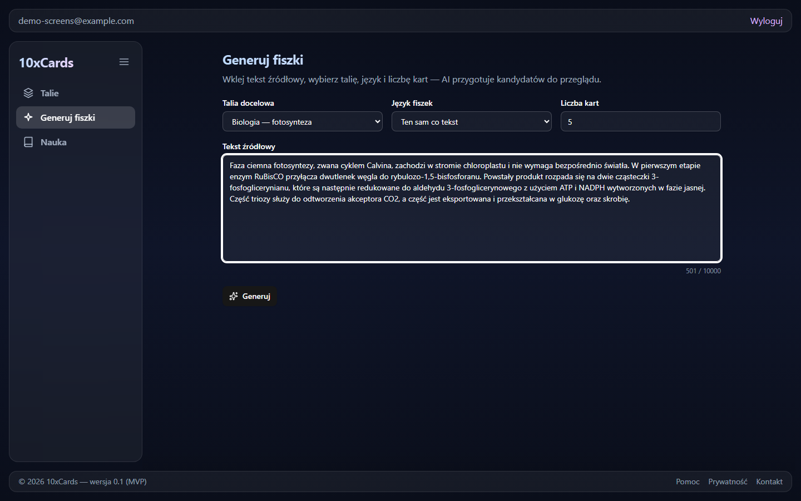
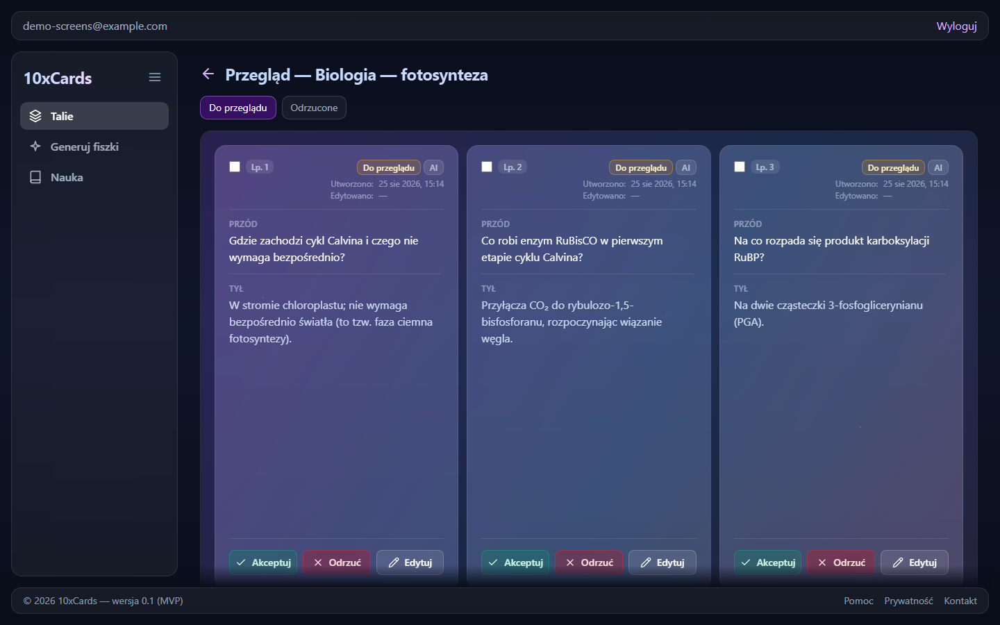
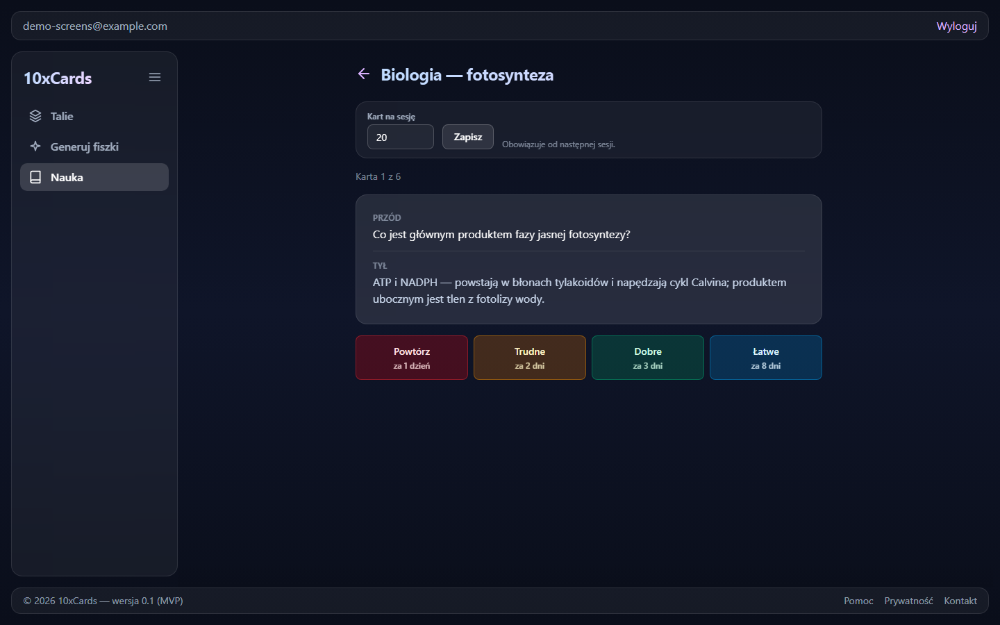

# 10xCards

AI-assisted flashcards: paste a block of source text, review the cards an LLM generates from
it, and study them with spaced repetition.

Creating good flashcards by hand is the step where most learners give up on spaced
repetition — the method is proven, but authoring a deck is slow. 10xCards removes that step:
you paste lecture notes, a textbook chapter, or an article, the app generates candidate
cards, and you accept, edit, or reject each one. Only accepted cards enter study, where an
FSRS scheduler decides what to show and when. The product bets on generation quality plus
simplicity, not on owning the scheduling algorithm.

The UI is in Polish; the flashcards and source text follow the language of the user's
material (Polish, English, Spanish, …) — generation produces cards in the language of the
source text.

Full product scope, personas, and functional requirements live in the PRD:
[`context/foundation/prd.md`](context/foundation/prd.md).

## Core flows

- **Generate** (`/generate`) — paste source text, pick a deck, and get a set of candidate
  cards from the LLM (via [OpenRouter](https://openrouter.ai/); without an API key the
  generator falls back to deterministic mock cards, which is what the test suite relies on).
  Each generation is recorded as an audit session, and a retry after a timeout is
  idempotent — no duplicated candidates.
- **Review** — every card carries a state: `generated` → `accepted` / `rejected`
  (transitions enforced in `src/lib/flashcards.ts`). Accept, edit, or reject candidates
  individually or in bulk; only accepted cards can be studied. Manual card authoring
  (front/back CRUD) is the complement for what generation misses.
- **Study** (`/study`) — a session shows only the cards due now; you rate recall on a
  4-button scale (Again / Hard / Good / Easy) and [FSRS-6](https://github.com/open-spaced-repetition/ts-fsrs)
  (`ts-fsrs`, configured deterministically in `src/lib/study.ts`) computes the next review
  date. The schedule is persisted per card and survives between sessions.
- **Decks** (`/decks`) — every card belongs to a named deck; browsing, filtering by state,
  and keyword search operate within a deck.

Accounts are email + password (Supabase Auth). Data is private per user — isolation is
enforced by Postgres row-level security (`user_id = auth.uid()` policies in
`supabase/migrations/`), guarded in depth by the middleware route guard
(`src/middleware.ts`) and by cross-account isolation tests (`tests/isolation/`).

## Screenshots

Paste source text and request candidates:



Review the generated candidates — accept, edit, or reject each one:



Study the accepted cards — each rating shows the FSRS interval it would schedule:



## Tech Stack

- [Astro](https://astro.build/) v6 — server-rendered pages with API routes
- [React](https://react.dev/) v19 — interactive islands (generation review, study session)
- [TypeScript](https://www.typescriptlang.org/) v5 + [Zod](https://zod.dev/) — types and request validation
- [Tailwind CSS](https://tailwindcss.com/) v4 — styling
- [Supabase](https://supabase.com/) — Postgres (with RLS) and authentication
- [OpenRouter](https://openrouter.ai/) — LLM provider for card generation (mock fallback without a key)
- [ts-fsrs](https://github.com/open-spaced-repetition/ts-fsrs) — FSRS-6 spaced-repetition scheduler
- [Cloudflare Workers](https://workers.cloudflare.com/) — edge deployment runtime
- [Sentry](https://sentry.io/) — error monitoring, wrapped around the Worker in `src/worker.ts`
- [Vitest](https://vitest.dev/) + [Playwright](https://playwright.dev/) + [Stryker](https://stryker-mutator.io/) — tests (see [Testing](#testing))

## Prerequisites

- Node.js v22.14.0 (as specified in `.nvmrc`)
- npm (comes with Node.js)
- [Docker](https://www.docker.com/) — for the local Supabase stack (~7 GB RAM)

## Getting Started

1. Clone the repository:

```bash
git clone https://github.com/lirdaw/10xcards.git
cd 10xcards
```

2. Install dependencies (this also installs the husky git hooks — needed once per checkout/worktree):

```bash
npm install
```

3. Set up the local Supabase stack and configure environment variables — see
   [Supabase Configuration](#supabase-configuration) below.

4. Run the development server:

```bash
npm run dev
```

Without `OPENROUTER_API_KEY` in `.env`, generation serves mock cards — the full flow works
end-to-end locally with no LLM key and no cost.

## Available Scripts

- `npm run dev` - Start development server (Cloudflare workerd runtime)
- `npm run build` - Build for production
- `npm run preview` - Preview production build
- `npm run typecheck` - The type gate: `astro sync`, then `tsc --noEmit`, then `astro check` over `src/`, `tests/` (which since 2026-08-05 also means the Playwright specs under `tests/e2e/`), `evals/`, `scripts/`, the root configs, and the 18 `.astro` templates `tsc` cannot see. No file total is quoted here on purpose: the gate asserts on a **floor**, so the count moves whenever a file enters or leaves the tree and a number pinned in prose only re-rots. Runs in CI and on `git push` via a husky `pre-push` hook
- `npm run lint` - Run ESLint with **type-aware rules** — note this is not the same thing as a type check: it reads types to decide rules, and reports no `tsc` diagnostic. That distinction is why `npm run typecheck` exists as a separate script
- `npm run lint:fix` - Auto-fix ESLint issues
- `npm run format` - Run Prettier. Note `context/archive/**` is in `.prettierignore`, so archived evidence is never reformatted (dated corrections are appended to it, never rewrites)
- `npm test` - The Vitest integration suite, run against the local Supabase stack (`npm run db:start` first). A preflight (`tests/setup/preflight.ts`) aborts if `SUPABASE_URL` is not local or `OPENROUTER_API_KEY` is set — the suite asserts card counts that only mock generation guarantees. How to add a test: `context/foundation/test-plan.md` §6
- `npm run e2e` - The Playwright browser layer (three specs). It **starts and owns its own dev server**, so port 4321 must be free — a server you started by hand is a hard error rather than a silent attach, deliberately, because attaching to a foreign server leaves no way to tell which Supabase project it points at. It refuses any non-local `SUPABASE_URL` **before** that server boots, mints its own signed-in session by driving the real sign-in form, and removes the rows it created in a teardown that runs whatever the outcome. Requires the local stack (`npm run db:start`) and, once per checkout, `npx playwright install chromium` — the preflight names that command when the browser is missing. **Local only and human-triggered: there is no CI job, no schedule, and nothing may declare one in `needs:`.** What a green run does **not** prove: the specs' source is type-checked and lint-checked in CI, but the journeys themselves never run there, so a green `ci` job says this layer compiles and lints — never that anything exercised it
- `npm run eval` - The generation-quality eval (LLM-as-judge on card language and usability) against the real OpenRouter provider — **costs money**; see the `eval` workflow under [CI](#ci) for the key it needs and why a red run is a finding, not a hygiene failure
- `npm run db:start` / `npm run db:stop` - Start/stop the local Supabase stack. `db:start` also runs `npm run db:kong` (see [Supabase Configuration](#supabase-configuration))
- `npm run db:reset` - Re-apply all migrations to the local database (wipes local data)
- `npm run db:types` - Regenerate `src/db/database.types.ts` from the local schema — run after adding a migration; CI fails on a stale copy

## Project Structure

```md
.
├── src/
│ ├── pages/ # Astro routes: /decks, /generate, /study, /auth, /dashboard
│ │ └── api/ # API endpoints: auth, decks + cards CRUD, generate, study
│ ├── components/ # UI: auth/, decks/, flashcards/, generate/, review/, study/, ui/
│ ├── lib/ # Domain logic: flashcards.ts, decks.ts, study.ts (FSRS),
│ │ # openrouter.ts, generations.ts, supabase.ts, …
│ ├── db/ # Generated Supabase types (database.types.ts)
│ ├── middleware.ts # Auth route guard (PROTECTED_ROUTES)
│ └── worker.ts # Deployed Worker entry — wraps the adapter handler in Sentry
├── supabase/
│ └── migrations/ # Schema + RLS policies (source of truth for the database)
├── tests/ # Vitest suites: isolation/, generation/, study/, auth/, db/, lib/
│ └── e2e/ # Playwright specs (local-only browser layer)
├── evals/ # Generation-quality eval (LLM-as-judge)
├── agents/review/ # PR review agent: prompt, criteria, promptfoo eval matrix
├── scripts/ # CI tooling (typecheck gate, schema drift, prompt ratchets)
├── context/
│ ├── foundation/ # PRD, roadmap, tech-stack, test plan — the docs the app is built from
│ ├── changes/ # Per-change working folders (plan, research, review)
│ └── archive/ # Archived change folders (append-only evidence)
├── public/ # Public assets
├── wrangler.jsonc # Cloudflare Workers config
```

Conventions for working in this repository (import rules, env access, commit format) live
in [`AGENTS.md`](AGENTS.md).

## Application Routes

| Route                 | Description                                                                |
| --------------------- | -------------------------------------------------------------------------- |
| `/auth/signin`        | Email/password sign-in form                                                |
| `/auth/signup`        | Email/password sign-up form                                                |
| `/auth/confirm-email` | Post-signup "check your inbox" page                                        |
| `/dashboard`          | Signed-in landing page                                                     |
| `/decks`              | Deck list; `/decks/[publicId]` shows a deck's cards (filter, search, CRUD) |
| `/generate`           | Paste source text → generate candidates → review (accept / edit / reject)  |
| `/study`              | Deck picker; `/study/[publicId]` runs the spaced-repetition session        |

All routes except `/auth/*` and the landing page are protected. Route protection is handled
in `src/middleware.ts` — add paths to the `PROTECTED_ROUTES` array there to require
authentication.

## Supabase Configuration

This project uses [Supabase](https://supabase.com/) for authentication and as its Postgres
database. Environment variables are declared via Astro's `astro:env` schema and are treated
as **server-only secrets** — they are never exposed to the client.

> **Local secrets live in `.env` only.** With Astro 6 + `@astrojs/cloudflare`, `npm run dev`
> runs on the real Cloudflare `workerd` runtime and reads `.env` directly. Do **not** also
> create a `.dev.vars` file — if both exist, Cloudflare ignores `.env` and reads `.dev.vars`
> (they are mutually exclusive). Production secrets are set separately via
> `npx wrangler secret put` (see [Deployment](#deployment)).

### First-time setup (local, no cloud project needed)

Requires [Docker](https://www.docker.com/) and ~7 GB RAM. The `supabase/` config folder is
checked in — do **not** run `npx supabase init`.

1. Create your `.env` file from the annotated template:

```bash
cp .env.example .env
```

2. Start the local stack (downloads Docker images on first run, applies the migrations from
   `supabase/migrations/`):

```bash
npm run db:start
```

This wraps `npx supabase start` and then runs `npm run db:kong` — it disables Kong's
upstream keep-alive pooling, without which the local stack answers an occasional
`502 upstream prematurely closed connection` on the first requests after an idle gap. The
Kong tweak is wiped by every `npx supabase stop`, so re-apply it (or just use
`npm run db:start`) after each start.

3. Copy the credentials printed by the CLI (`npx supabase status`) into your `.env` file:

```
SUPABASE_URL=http://127.0.0.1:54321
SUPABASE_KEY=<publishable/anon key from CLI output>
```

`SUPABASE_KEY` must be the publishable (anon) key, never the secret/service_role key: a
secret key bypasses RLS, and RLS is the only thing isolating accounts in this app. The test
preflight refuses to run if you get this wrong.

4. To stop the stack when done:

```bash
npm run db:stop
```

The local Studio UI is available at `http://localhost:54323`.

The database schema lives in `supabase/migrations/` (tables, constraints, and the RLS
policies that scope every row to its owner). After adding a migration, run
`npm run db:reset` to apply it locally and `npm run db:types` to regenerate
`src/db/database.types.ts` — CI fails when the committed types drift from the migrations.

### Environment variables

| Variable             | Required?          | Description                                                                                                                                                                                                                           |
| -------------------- | ------------------ | ------------------------------------------------------------------------------------------------------------------------------------------------------------------------------------------------------------------------------------- |
| `SUPABASE_URL`       | yes                | Local stack URL, or Project URL from the Supabase dashboard → Settings → API                                                                                                                                                          |
| `SUPABASE_KEY`       | yes                | The **publishable (anon)** key — never the secret key (see above)                                                                                                                                                                     |
| `OPENROUTER_API_KEY` | no (mock fallback) | LLM generation via OpenRouter. Unset = deterministic mock cards (required unset for `npm test`). On production a missing key means mock cards ship silently — set it there and verify a real generation after deploy                  |
| `OPENROUTER_MODEL`   | no                 | Model override for generation                                                                                                                                                                                                         |
| `SENTRY_DSN`         | no                 | Error monitoring. Normally empty locally (SDK's no-transport branch). On production it is a **Worker secret** read in `src/worker.ts`, not part of the `astro:env` schema — see `context/changes/sentry-monitoring/deploy-runbook.md` |

See `.env.example` for the full annotated version of this table.

### Email confirmation in local development

By default Supabase requires email confirmation before a user can sign in. To skip this
during local development:

1. Open the Supabase dashboard for your project
2. Go to **Authentication → Email → Confirm email**
3. Toggle it **off**

Users can then sign in immediately after sign-up without clicking a confirmation link.

## Testing

The strategy, risk map, and per-suite cookbook live in
[`context/foundation/test-plan.md`](context/foundation/test-plan.md) — every suite maps to a
named risk from its §2 Risk Map. The layers:

- **Integration (Vitest, `npm test`)** — runs against the real local Supabase stack, driving
  the actual API endpoints. Highlights: `tests/isolation/` proves cross-account RLS
  isolation (risk #1) by asserting both the denied response _and_ the untouched row;
  `tests/generation/` covers the retry/idempotency path (risk #2); `tests/study/` pins the
  FSRS schedule with exact-`due` oracle tests (risk #3).
- **E2E (Playwright, `npm run e2e`)** — local-only browser journeys; see the script's entry
  under [Available Scripts](#available-scripts).
- **Mutation testing (Stryker)** — selective, on risk-critical modules only; used to audit
  test strength for code touched by a change, not chased to 100%.
- **Generation-quality eval (`npm run eval`)** — LLM-as-judge on card language and
  usability; the only check that reaches the real AI provider.

## Deployment

This project deploys to [Cloudflare Workers](https://workers.cloudflare.com/).

1. Build the project:

```bash
npm run build
```

2. Deploy with Wrangler:

```bash
npx wrangler deploy
```

Set `SUPABASE_URL`, `SUPABASE_KEY`, and `OPENROUTER_API_KEY` (plus optionally
`OPENROUTER_MODEL` and `SENTRY_DSN`) as secrets via `npx wrangler secret put`. Apply
migrations to the cloud project with `npx supabase db push` **before** merging — CI's
`drift` job blocks `deploy` otherwise.

## CI

GitHub Actions runs on every push and PR to `main`, in three jobs:

1. **`ci`** — typecheck, lint, build, then a local Supabase stack for the test suite. It also
   regenerates `src/db/database.types.ts` and fails on a non-empty `git diff`, so committed
   types cannot go stale against the migrations that generate them.
   The `npm run typecheck` step (added 2026-08-03, C10X-43) sits between `astro sync` and `lint`
   and is **fail-closed** — no `continue-on-error`, so unlike the Kong keep-alive step in the same
   job, a green `ci` job **does** imply the typecheck passed. It needs only `npm ci`: no stack, no
   Docker, no credential and no `.env`. Placing it before `build` matters because `astro build`
   does not type-check, and placing it far before the ~1m46s `supabase start` means a type error
   fails the run at roughly T+15 s rather than T+2 min.
2. **`drift`** — `needs: ci`, and it runs only on a push to `main`. It compares the
   repository's migration versions against the cloud project's applied migrations (read
   through the Supabase Management API) and fails when either side carries something the
   other does not.
3. **`deploy`** — `needs: [ci, drift]`. The Worker ships only when both are green.

Two further workflows are **`workflow_dispatch` only** — no schedule, and nothing declares
either in `needs:`, so neither can block a release:

- **`schema-diff`** runs a DDL comparison (`supabase db diff`) against the cloud project.
  A red DDL diff never blocks a release.
- **`eval`** ("Generation quality eval") runs `npm run eval` against the real OpenRouter
  provider — the LLM-as-judge check on card language and usability, and the project's only
  check that reaches the real AI provider. The 11-row verdict table is printed into the job
  log; the card-by-card record, and the raw console stream, go to an artifact named for the
  run attempt. **A red run here is a finding, not a hygiene failure**: `npm run eval` exits
  1 on a real generation defect by design (C10X-31's first calibrated run was honestly red
  and found a real bug), so the contract is "run it and read the table", never "keep it
  green".

Both are human-triggered on purpose. A schedule would produce a signal with no consumer:
this project has no notification channel, so a nightly red in a tab nobody reads is an alarm
without a listener rather than coverage. Adding `schedule:` is one line — do it the day a
channel and an owner exist.

### Repository secrets

| Secret                                          | Used by                | Required?                                                                                                                                                                                                                                                                                                                                                                                                                                                                                                               |
| ----------------------------------------------- | ---------------------- | ----------------------------------------------------------------------------------------------------------------------------------------------------------------------------------------------------------------------------------------------------------------------------------------------------------------------------------------------------------------------------------------------------------------------------------------------------------------------------------------------------------------------- |
| `CLOUDFLARE_API_TOKEN`, `CLOUDFLARE_ACCOUNT_ID` | `deploy`               | yes                                                                                                                                                                                                                                                                                                                                                                                                                                                                                                                     |
| `SUPABASE_ACCESS_TOKEN`                         | `drift`, `schema-diff` | yes — a **dedicated** Supabase personal access token, not a developer's own                                                                                                                                                                                                                                                                                                                                                                                                                                             |
| `SUPABASE_PROJECT_ID`                           | `drift`, `schema-diff` | yes — the cloud project ref                                                                                                                                                                                                                                                                                                                                                                                                                                                                                             |
| `SUPABASE_DB_PASSWORD`                          | `schema-diff` only     | yes for that workflow — without it the CLI mints a temporary **read-write** role on production                                                                                                                                                                                                                                                                                                                                                                                                                          |
| `OPENROUTER_EVAL_KEY`                           | `eval` only            | yes for that workflow — an OpenRouter key **dedicated to the eval** and carrying a low per-key credit limit, never production's (production's is a Worker secret set by `wrangler secret put`, not a repository secret). That limit is the blast-radius cap: OpenRouter refuses an over-cap request with `402`, and the eval throws on it immediately rather than retrying. It is the same eval key a developer uses locally — one key, one purpose, one cap — so it buys **spend** isolation, not rate-limit isolation |

| `OPENROUTER_REVIEW_KEY` | `pr-review` only | yes for that workflow — review's **own** OpenRouter key, and deliberately not `OPENROUTER_EVAL_KEY`. Review runs on every push to every pull request, so sharing the eval's key would make review the consumer that drains the eval's cap and leaves the eval failing on credit it never spent — measured, run 32534464639, `402 This request requires more credits` after three review runs in one afternoon. OpenRouter also spends per KEY, so one shared key makes "what did review cost?" and "what did the eval cost?" unanswerable from the dashboard. Same caveat as above: separate keys buy **spend** isolation, not rate-limit isolation, which is governed per account |

`SUPABASE_URL` / `SUPABASE_KEY` are **not** repository secrets and must not be added: the
build does not read them, and the test suite gets them from the local stack it starts.

`OPENROUTER_EVAL_KEY` is the store name only — the `eval` workflow exports it to the step as
`OPENROUTER_API_KEY`, which is what the eval's preflight reads. It must **not** be added to
`.env`: a key there feeds only one of the two seams and makes the next `npm test` abort, by
design.

### When `drift` goes red

A deploy now depends on the Supabase Management API being reachable, and the gate fails
closed — so read the job log, which labels the failure:

- **`DRIFT`** — the comparison ran and disagreed. Run `supabase db push`, then
  `gh run rerun --failed` to re-run `drift` and the dependent `deploy`.
- **`GATE UNAVAILABLE`** — the comparison never ran (missing secret, API error). This says
  nothing about the schema. A job whose `needs` failed cannot be started on its own, so a
  prolonged outage is escaped only by a commit removing `drift` from `deploy`'s `needs`.

The full procedure, including which steps are production-mutating, lives in the ship
runbook (`.claude/skills/ship/SKILL.md`).

## Project documentation

In the 10x workflow the app is generated from its written foundation, which lives in
[`context/foundation/`](context/foundation/):

- [`prd.md`](context/foundation/prd.md) — product requirements: vision, personas, success criteria, functional requirements
- [`roadmap.md`](context/foundation/roadmap.md) — ordered vertical slices the product was built in
- [`tech-stack.md`](context/foundation/tech-stack.md) — stack selection and rationale
- [`test-plan.md`](context/foundation/test-plan.md) — risk map, phased test rollout, and the cookbook for adding tests
- [`infrastructure.md`](context/foundation/infrastructure.md) — deployment platform research

Per-change working documents (research, plan, implementation review) live under
`context/changes/`, and completed changes are archived to `context/archive/`.

## License

MIT
